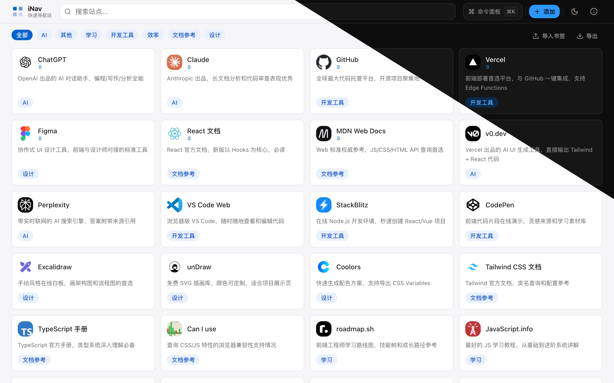
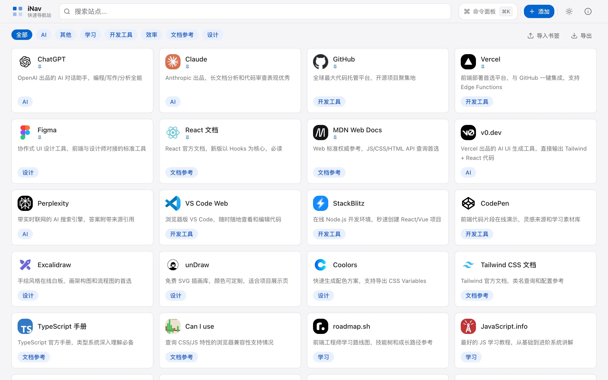

<div align="center">


# iNav

**轻、快、优雅的个人导航站**

[](https://react.dev)
[](https://www.typescriptlang.org)
[](https://tailwindcss.com)
[](https://vitejs.dev)
[](LICENSE)

[Demo](https://nav.dogxi.me) · [快速开始](#快速开始) · [功能特性](#功能特性) · [性能指标](#性能指标)

</div>

---

## 预览

https://nav.dogxi.me



| 亮色                                   | 暗色                                   |
| -------------------------------------- | -------------------------------------- |
|  |  |

---

## 简介

iNav 是一个以 **i（intelligent & instant）** 为核心理念设计的个人导航站。  
专注于**极致使用体验**，而不是功能堆砌：

- 打开即用，任意键聚焦搜索
- ⌘K 命令面板秒级跳转任意站点
- 自定义添加 / 编辑 / 删除站点，数据永久保存在本地
- 浏览器书签一键导入，自动分类
- 亮暗主题零闪烁切换
- Lighthouse 性能 / 可访问性 / SEO / 最佳实践全项通过

---

```bash
# 克隆仓库
git clone https://github.com/dogxii/iNav.git
cd iNav

# 安装依赖
bun install

# 开发服务器（http://localhost:5173）
bun dev

# 类型检查 + 生产构建
bun run build

# 预览生产构建（http://localhost:4173）
bun run preview
```

### 添加自定义站点

**方式一：通过 UI 添加（推荐）**

点击 Header 右侧的「+ 添加」按钮，填写表单后自动保存到 `localStorage`。

**方式二：编辑内置数据**

编辑 `src/data/sites.json`：

```json
{
  "id": "my-site",
  "name": "我的站点",
  "url": "https://example.com",
  "description": "站点描述",
  "iconUrl": "https://ico.dogxi.me/icon?domain=example.com",
  "category": "效率",
  "pinned": false,
  "tags": ["工具"]
}
```

**可用分类：** `AI` · `开源项目` · `开发工具` · `设计` · `文档参考` · `学习` · `效率` · `娱乐` · `其他`

### 导入浏览器书签

1. Chrome / Firefox：菜单 → 书签 → 导出书签，得到 `.html` 文件
2. 点击页面工具栏中的「导入书签」按钮
3. 选择文件，自动导入并将文件夹作为标签（暂未实现分类）

---

## 功能特性

### 搜索与导航

| 功能                        | 说明                                                          |
| --------------------------- | ------------------------------------------------------------- |
| **任意键聚焦搜索**          | 非输入状态下按任意可打印字符，搜索框立即获焦                  |
| **多字段模糊搜索**          | 同时搜索站点名称、描述、标签、URL                             |
| **搜索关键词高亮**          | 匹配字符在卡片中实时高亮                                      |
| **搜索引擎快捷跳转**        | 输入关键词后可选 Google / Bing / DuckDuckGo / GitHub 直接搜索 |
| **分类筛选**                | 横向滚动分类标签条，点击筛选，再次点击取消                    |
| **Ctrl/Cmd + 1~9 快捷打开** | 搜索状态下，前 9 个结果可用数字键直接打开                     |

### 命令面板（⌘K）

- `⌘K` / `Ctrl+K` 唤起全屏命令面板
- 模糊搜索 + 相关度排序：名称完全匹配 > 前缀匹配 > 包含匹配 > 描述/标签匹配
- 键盘上下导航，`Enter` 在新标签页打开，`Esc` 关闭
- 无输入时展示置顶 / 最近添加站点

### 站点管理

- **添加站点**：名称、URL、描述、分类、标签、置顶，URL 输入后自动生成 favicon
- **编辑站点**：Hover 快捷按钮或右键菜单触发
- **删除站点**：带二次确认，防止误操作
- **内置站点本地隐藏**：可隐藏不需要的内置站点，随时恢复
- **置顶**：置顶站点始终排在网格首位

### 右键上下文菜单

在任意站点卡片上**右键**（桌面）或**长按 600ms**（移动端）弹出菜单：

- 在新标签页打开 / 复制链接
- 编辑 / 置顶（仅自定义或导入站点）
- 删除 / 本地隐藏（带二次确认）

菜单自动检测屏幕边界，滚动时自动关闭，支持键盘上下导航。

### 书签导入 / 导出

- **导入**：支持 Chrome / Firefox 标准 Netscape 书签 HTML，递归遍历文件夹，按文件夹名自动猜测分类
- **导出 JSON**：导出当前所有可见站点为结构化 JSON
- **导出书签 HTML**：导出为浏览器可直接导入的书签文件，按分类分组

### 主题系统

- 跟随系统偏好（`prefers-color-scheme`）或手动切换亮 / 暗色
- **零闪烁**：`<head>` 内联脚本在 FCP 前设置 `data-theme`，彻底消除白闪
- 主题偏好持久化到 `localStorage`，刷新后恢复

---

<!--## 技术亮点

### 1. 零闪烁主题切换（FOUC 消除）

```html
<script>
  ;(function () {
    try {
      var stored = localStorage.getItem('inav-theme')
      var prefersDark = window.matchMedia(
        '(prefers-color-scheme: dark)',
      ).matches
      document.documentElement.dataset.theme =
        stored || (prefersDark ? 'dark' : 'light')
    } catch (e) {
      document.documentElement.dataset.theme = 'light'
    }
  })()
</script>
```

同步执行，在 CSS 解析前设置 `data-theme`，配合 Tailwind v4 `@theme` CSS 变量实现 150ms 平滑过渡，无任何闪烁。

### 2. React 19 useDeferredValue 搜索优化

```tsx
const deferredQuery = useDeferredValue(query)

const filteredSites = useMemo(
  () => filterSites(allSites, deferredQuery, activeCategory),
  [allSites, deferredQuery, activeCategory],
)
```

输入框绑定高优先级 `query`（即时响应），过滤计算绑定低优先级 `deferredQuery`（空闲帧执行）。无需手写 `debounce`，输入无延迟感。

### 3. 命令面板相关度评分

```ts
if (name === q)
  score += 100 // 完全匹配
else if (name.startsWith(q))
  score += 60 // 前缀匹配
else if (name.includes(q)) score += 40 // 包含匹配
if (desc.includes(q)) score += 20 // 描述匹配
if (tags.includes(q)) score += 15 // 标签匹配
if (site.pinned) score += 5 // 置顶加权
```

### 4. Tailwind v4 Design Token 系统

```css
@theme {
  --color-primary: #0064d1;
  --color-background: #f5f5f7;
  --color-muted-foreground: #6e6e73; /* WCAG AA 对比度 ≥ 4.5:1 */
  --radius-card: 8px;
  --duration-fast: 100ms;
}

[data-theme='dark'] {
  --color-primary: #2997ff;
  --color-background: #0d0d0d;
}
```

### 5. 原子设计（Atomic Design）组件架构

```
src/components/
├── atoms/       # Button, Input, Badge, Icons
├── molecules/   # SearchBar, NavCard, CategoryFilter, BookmarkIO, ContextMenu
└── organisms/   # Header, NavGrid, CommandPalette, SiteFormModal
```

### 6. 懒加载 + modulepreload 优化

`CommandPalette` 和 `SiteFormModal` 通过 `React.lazy()` 懒加载，首屏 JS 主 chunk 仅 **74KB**（gzip 21KB）。Vite 构建自动注入 `<link rel="modulepreload">` 消除关键路径瀑布链。

### 7. localStorage 多 Hook 持久化

| Hook             | Storage Key           | 功能                   |
| ---------------- | --------------------- | ---------------------- |
| `useTheme`       | `inav-theme`          | 主题偏好               |
| `useSiteManager` | `inav-custom-sites`   | 自定义站点 CRUD        |
| `useSiteManager` | `inav-hidden-builtin` | 内置站点本地隐藏       |
| `useBookmarks`   | `inav-imported-sites` | 书签导入数据           |
| `useEngineOrder` | `inav:engine-order`   | 搜索引擎顺序与启用状态 |

---

## 技术栈

| 技术                                         | 版本   | 用途                         |
| -------------------------------------------- | ------ | ---------------------------- |
| [React](https://react.dev)                   | 19     | UI 框架，并发特性            |
| [TypeScript](https://www.typescriptlang.org) | 5      | strict 模式，零 any          |
| [Vite](https://vitejs.dev)                   | 7      | 构建工具，ESM + HMR          |
| [Tailwind CSS](https://tailwindcss.com)      | v4     | Utility-first + Design Token |
| [React Router](https://reactrouter.com)      | v7     | 客户端路由，懒加载           |
| [Biome](https://biomejs.dev)                 | 2      | Linter + Formatter           |
| [Bun](https://bun.sh)                        | latest | 包管理器 + 运行时            |

----->

<!--## 项目结构

```
iNav/
├── public/
│   ├── favicon.svg
│   ├── robots.txt
│   └── sitemap.xml
├── scripts/
│   └── release.sh          # 发版脚本
├── src/
│   ├── components/
│   │   ├── atoms/
│   │   │   ├── Badge.tsx
│   │   │   ├── Button.tsx
│   │   │   ├── Icons.tsx   # 共享 SVG 图标库
│   │   │   └── Input.tsx
│   │   ├── molecules/
│   │   │   ├── BookmarkIO.tsx
│   │   │   ├── CategoryFilter.tsx
│   │   │   ├── ContextMenu.tsx
│   │   │   ├── EngineSettings.tsx
│   │   │   ├── NavCard.tsx
│   │   │   └── SearchBar.tsx
│   │   └── organisms/
│   │       ├── CommandPalette.tsx
│   │       ├── Header.tsx
│   │       ├── NavGrid.tsx
│   │       └── SiteFormModal.tsx
│   ├── config/
│   │   └── features.ts     # Feature flags（功能开关）
│   ├── data/
│   │   └── sites.json      # 内置站点数据
│   ├── hooks/
│   │   ├── useBookmarks.ts
│   │   ├── useEngineOrder.ts
│   │   ├── useSiteManager.ts
│   │   └── useTheme.ts
│   ├── pages/
│   │   ├── About.tsx
│   │   └── Home.tsx
│   ├── types/
│   │   └── index.ts
│   ├── utils/
│   │   └── favicon.ts
│   ├── index.css           # 全局样式 + Design Token
│   ├── main.tsx
│   └── route.tsx
├── index.html              # 骨架屏 + 防 FOUC 内联脚本
├── vercel.json             # 路由重写 + 缓存策略
├── vite.config.ts
└── biome.json
```-->

---

## 快捷键

| 快捷键                   | 功能                             |
| ------------------------ | -------------------------------- |
| `⌘K` / `Ctrl+K`          | 打开命令面板                     |
| 任意可打印字符           | 聚焦搜索框（非输入状态）         |
| `Ctrl+数字` / `⌘ + 数字` | 搜索状态下直接打开第 N 个结果    |
| `↑` `↓`                  | 命令面板导航                     |
| `Enter`                  | 命令面板：在新标签页打开选中站点 |
| `Esc`                    | 关闭命令面板 / 表单 / 弹窗       |
| 右键 / 长按              | 打开站点上下文菜单               |

---

## 性能指标

> 以下数据基于 `bun run build && bun run preview`（生产构建），用 Chrome Lighthouse 测量。


| 指标              | 数值   | 说明                                    |
| ----------------- | ------ | --------------------------------------- |
| Performance       | 100    | 生产构建 preview 模式                   |
| Accessibility     | 100    | WCAG AA 色彩对比度全通过                |
| Best Practices    | 100    |                                         |
| SEO               | 100    | robots.txt + sitemap.xml                |
| 首屏 JS（gzip）   | ~111KB | react-dom 56KB + router 30KB + app 21KB |
| 主 chunk（gzip）  | 21KB   | 懒加载后的应用代码                      |
| TypeScript 覆盖率 | 100%   | strict 模式，零 any                     |

---

## 控制功能可见性

编辑 `src/config/features.ts` 可控制功能可见性：

```ts
export const ALLOW_BOOKMARK_IMPORT = true // 书签导入入口
export const ALLOW_BOOKMARK_EXPORT = true // 书签导出入口
export const ALLOW_CUSTOM_SITES = true // 添加自定义站点
export const ALLOW_HIDE_BUILTIN = true // 本地隐藏内置站点
```

---

## License

MIT © [dogxii](https://github.com/dogxii/inav)
