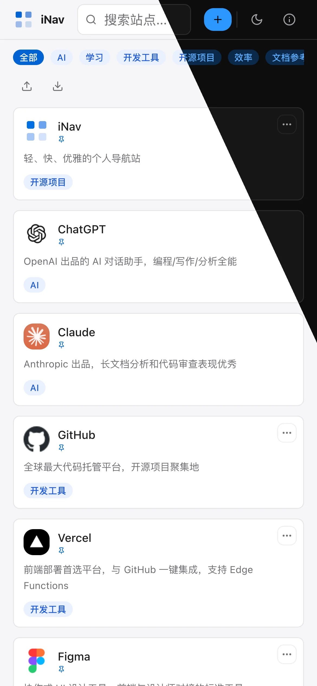
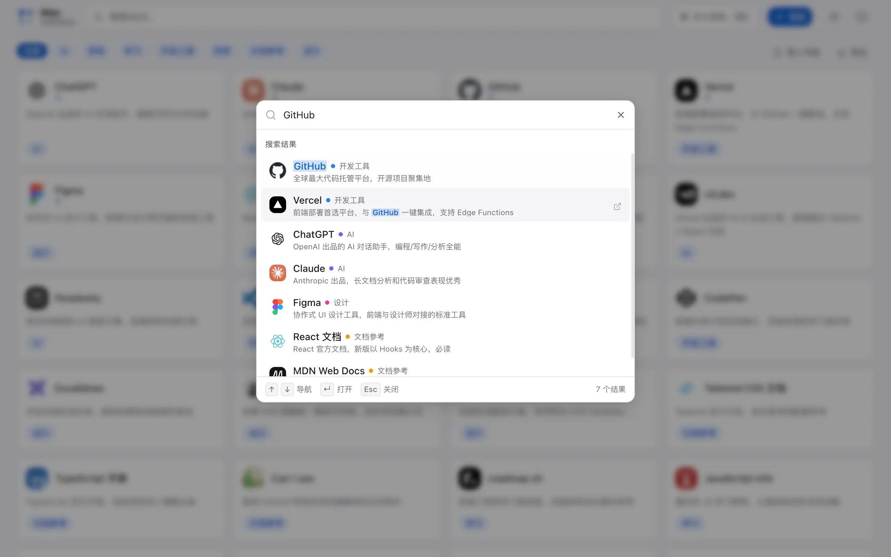
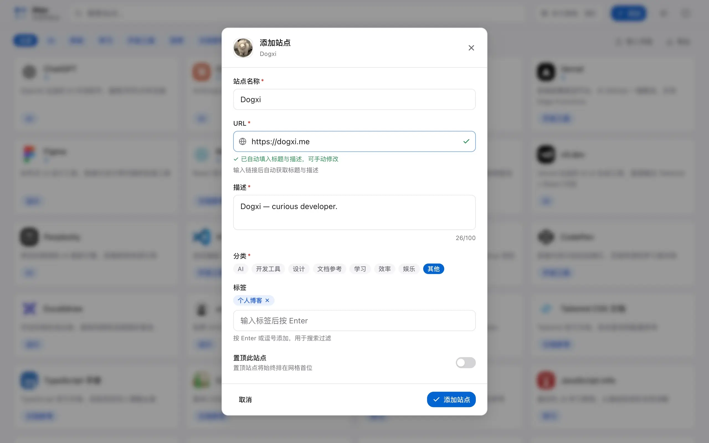
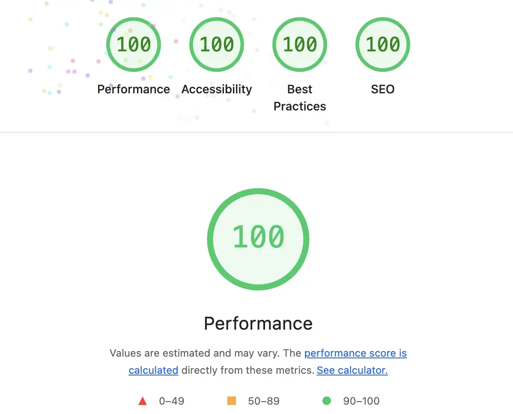

<div align="center">


# iNav

**轻、快、优雅的个人导航站**

[](https://react.dev)
[](https://www.typescriptlang.org)
[](https://tailwindcss.com)
[](https://vitejs.dev)
[](LICENSE)

[Demo](https://nav.dogxi.me) · [快速开始](#快速开始) · [功能特性](#功能特性) · [性能指标](#性能指标) · [待办规划](#待办规划)

</div>

---

## 预览

https://nav.dogxi.me


<details>
  <summary>展开查看更多预览</summary>

  <br />


| 桌面端首页                                   | 移动端首页                                 | 命令面板                       | 创建站点                                   |
| -------------------------------------------- | ------------------------------------------ | ------------------------------ | ------------------------------------------ |
|  |  |  |  |


</details>

---

## 简介

iNav 是一个以 **i（intelligent & instant）** 为核心理念设计的个人导航站。  
专注于**极致使用体验**，而不是功能堆砌：

- 打开即用，任意键聚焦搜索
- ⌘K 命令面板秒级跳转任意站点
- 自定义添加 / 编辑 / 删除站点，数据永久保存在本地
- 浏览器书签一键导入，自动分类
- 亮暗主题零闪烁切换
- Lighthouse 性能 / 可访问性 / SEO / 最佳实践全项通过

---

## 快速开始

```bash
# 克隆仓库
git clone https://github.com/dogxii/iNav.git
cd iNav

# 安装依赖
bun install

# 开发服务器（http://localhost:5173）
bun dev

# 类型检查 + 生产构建
bun run build

# 预览生产构建（http://localhost:4173）
bun run preview
```

### 添加自定义站点

**方式一：通过 UI 添加（推荐）**

点击 Header 右侧的「+ 添加」按钮，填写表单后自动保存到 `localStorage`。

**方式二：编辑内置数据**

编辑 `src/data/sites.json`：

```json
{
  "id": "my-site",
  "name": "我的站点",
  "url": "https://example.com",
  "description": "站点描述",
  "iconUrl": "https://ico.dogxi.me/icon?domain=example.com",
  "category": "效率",
  "pinned": false,
  "tags": ["工具"]
}
```

**可用分类：** `AI` · `开源项目` · `开发工具` · `设计` · `文档参考` · `学习` · `效率` · `娱乐` · `其他`

### 导入浏览器书签

1. Chrome / Firefox：菜单 → 书签 → 导出书签，得到 `.html` 文件
2. 点击页面工具栏中的「导入书签」按钮
3. 选择文件，自动导入并将文件夹作为标签（暂未实现分类）

---

## 功能特性

### 搜索与导航

| 功能                        | 说明                                                          |
| --------------------------- | ------------------------------------------------------------- |
| **任意键聚焦搜索**          | 非输入状态下按任意可打印字符，搜索框立即获焦                  |
| **多字段模糊搜索**          | 同时搜索站点名称、描述、标签、URL                             |
| **搜索关键词高亮**          | 匹配字符在卡片中实时高亮                                      |
| **搜索引擎快捷跳转**        | 输入关键词后可选 Google / Bing / DuckDuckGo / GitHub 直接搜索 |
| **分类筛选**                | 横向滚动分类标签条，点击筛选，再次点击取消                    |
| **Ctrl/Cmd + 1~9 快捷打开** | 搜索状态下，前 9 个结果可用数字键直接打开                     |

### 命令面板（⌘K）

- `⌘K` / `Ctrl+K` 唤起全屏命令面板
- 模糊搜索 + 相关度排序：名称完全匹配 > 前缀匹配 > 包含匹配 > 描述/标签匹配
- 键盘上下导航，`Enter` 在新标签页打开，`Esc` 关闭
- 无输入时展示置顶 / 最近添加站点

### 站点管理

- **添加站点**：名称、URL、描述、分类、标签、置顶，URL 输入后自动生成 favicon
- **编辑站点**：Hover 快捷按钮或右键菜单触发
- **删除站点**：带二次确认，防止误操作
- **内置站点本地隐藏**：可隐藏不需要的内置站点，随时恢复
- **置顶**：置顶站点始终排在网格首位

### 右键上下文菜单

在任意站点卡片上**右键**（桌面）或**长按 600ms**（移动端）弹出菜单：

- 在新标签页打开 / 复制链接
- 编辑 / 置顶（仅自定义或导入站点）
- 删除 / 本地隐藏（带二次确认）

菜单自动检测屏幕边界，滚动时自动关闭，支持键盘上下导航。

### 书签导入 / 导出

- **导入**：支持 Chrome / Firefox 标准 Netscape 书签 HTML，递归遍历文件夹，按文件夹名自动猜测分类
- **导出 JSON**：导出当前所有可见站点为结构化 JSON
- **导出书签 HTML**：导出为浏览器可直接导入的书签文件，按分类分组

### 主题系统

- 跟随系统偏好（`prefers-color-scheme`）或手动切换亮 / 暗色
- **零闪烁**：`<head>` 内联脚本在 FCP 前设置 `data-theme`，彻底消除白闪
- 主题偏好持久化到 `localStorage`，刷新后恢复

---

## 快捷键

| 快捷键                   | 功能                             |
| ------------------------ | -------------------------------- |
| `⌘K` / `Ctrl+K`          | 打开命令面板                     |
| 任意可打印字符           | 聚焦搜索框（非输入状态）         |
| `Ctrl+数字` / `⌘ + 数字` | 搜索状态下直接打开第 N 个结果    |
| `↑` `↓`                  | 命令面板导航                     |
| `Enter`                  | 命令面板：在新标签页打开选中站点 |
| `Esc`                    | 关闭命令面板 / 表单 / 弹窗       |
| 右键 / 长按              | 打开站点上下文菜单               |

---

## 性能指标

> 以下数据基于 `bun run build && bun run preview`（生产构建），用 Chrome Lighthouse 测量。



| 指标              | 数值   | 说明                                    |
| ----------------- | ------ | --------------------------------------- |
| Performance       | 100    | 生产构建 preview 模式                   |
| Accessibility     | 100    | WCAG AA 色彩对比度全通过                |
| Best Practices    | 100    |                                         |
| SEO               | 100    | robots.txt + sitemap.xml                |
| 首屏 JS（gzip）   | ~111KB | react-dom 56KB + router 30KB + app 21KB |
| 主 chunk（gzip）  | 21KB   | 懒加载后的应用代码                      |
| TypeScript 覆盖率 | 100%   | strict 模式，零 any                     |

---

## 待办规划

- [ ] 实现 iNav 管理后台页面
- [ ] 实现自定义分类
- [ ] ...

新功能及建议欢迎提 [Issue](../issues)，如果一拍即合，就会加入规划事项 = =。

---

## 控制功能可见性

编辑 `src/config/features.ts` 可控制功能可见性：

```ts
export const ALLOW_BOOKMARK_IMPORT = true // 书签导入入口
export const ALLOW_BOOKMARK_EXPORT = true // 书签导出入口
export const ALLOW_CUSTOM_SITES = true // 添加自定义站点
export const ALLOW_HIDE_BUILTIN = true // 本地隐藏内置站点
```

---

## License

MIT © [dogxii](https://github.com/dogxii)
